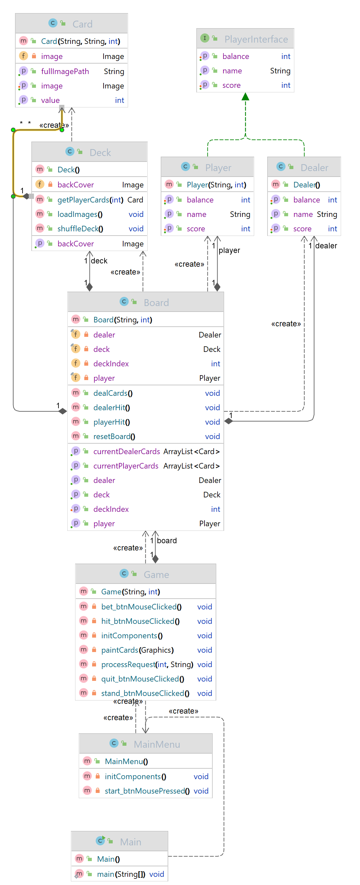
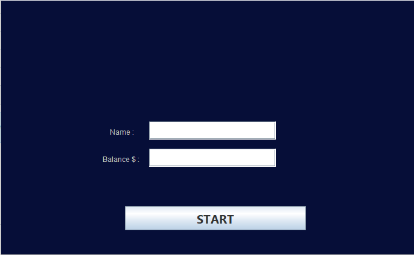
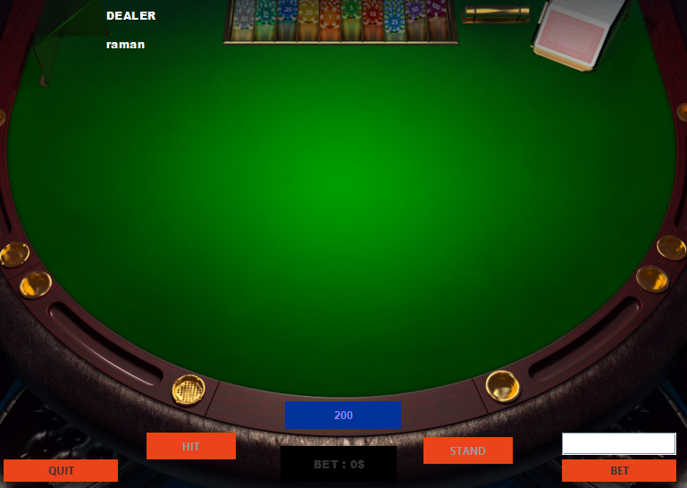
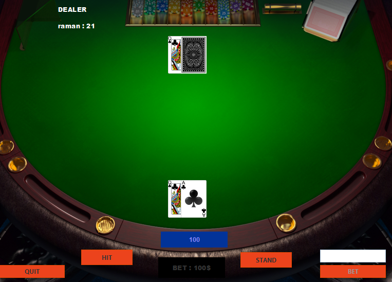
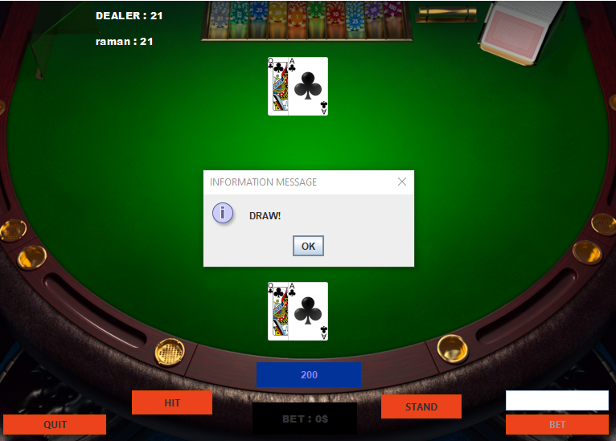

The game blackjack requires the player and dealer to have two cards each in order to be able to play the game, therefore the game needed cards and a deck. (“Blackjack Rules and Strategy”) One of the dealer's cards should not be visible to the player and consequently the game had to conceal one of the cards.(Blackjack Rules and Strategy, n.d.) When the game starts the player has the option to either stand or hit, the game displays those options as buttons. 

(Blackjack Rules and Strategy, n.d.) If the player's score is above 21, the game is over, otherwise, when the player stands, it's up to the dealers to hit. (Blackjack Rules and Strategy, n.d.) The dealer keeps hitting until the dealers’ score is 17 or higher. When the dealer has finished hitting and their score is less than 21, the player and dealer's score must be checked.(Blackjack Rules and Strategy, n.d.) 

When the player’s score is lower than the dealer’s score the player loses, otherwise the player wins. (Blackjack Rules and Strategy, n.d.) If both the dealer and the player score are equal, the game ends in a tie. (Blackjack Rules and Strategy, n.d.) When the player loses the initial bet is lost. Otherwise if the player wins, the player will receive their initial bet multiplied by two. When you play blackjack, you have to be able to place a bet and therefore the player needs a balance. (Blackjack Rules and Strategy, n.d.) If the balance is less than the bet, the player should not be able to place the bet and play the game.

The design of the game was done according to the model view controller pattern. (MVC Design Pattern, 2018) The model view controller pattern has a model which is responsible for  the data of the application. (MVC Design Pattern, 2018) It has a controller which is responsible for the logic of the program and updating the view. (MVC Design Pattern, 2018) The view is the graphical interface that uses the controller to run the game and display it for the users. (MVC Design Pattern, 2018)

The model view controller design pattern  was chosen because it allows for a clear structure of the code while keeping it clean. One option was to have the graphical user interface handle the game logic and display the game to the user instead of the game logic itself. It was concluded that keeping the code structured and separating the backend from the frontend would be more difficult. 

**Product pictures**

